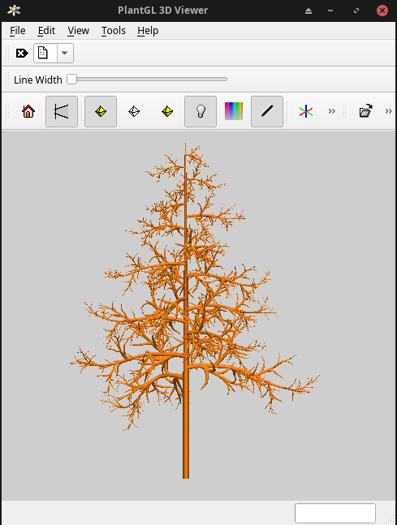

# WeberPenn

[](https://weberpenn.readthedocs.io/en/latest/?badge=latest)
[](https://github.com/openalea/weberpenn/actions/workflows/openalea_ci.yml)
[](https://www.python.org/downloads/)
[](https://anaconda.org/openalea3/openalea.weberpenn)
[](https://www.cecill.info/licences/Licence_CeCILL-C_V1-en.html)

An extension of the Weber and Penn model

<figure>
    
    <figcaption>3D plot realized with Openalea Visualea, see Tutorial.</figcaption>
</figure>

## Authors

> -   Christophe Pradal

## Installation

### Miniconda installation

Follow official website instruction to install miniconda :

<https://github.com/conda-forge/miniforge>

### For user
```commandline
mamba create -n weberpenn -c openalea3 -c conda-forge openalea.weberpenn
mamba activate weberpenn
```

### For developer, in an existing environment
```shell
git clone https://github.com/openalea/weberpenn.git
cd weberpenn
mamba install --only-deps -c openalea3 -c conda-forge openalea.weberpenn
pip install -e .[options]
```
[options] is optional, and allows to install additional dependencies 
defined in the [project.optional-dependencies] section of your 
pyproject.toml file (usually "dev", or "doc", ...)

### For maintainer that need clean isolated env, or to start development (i.e. before first build)

```commandline
mamba env create -f ./conda/environment.yml
```

## Tutorial

see visualea tutorial on [https://openalea.readthedocs.io/en/latest/tutorials/visualea/weberpenn.html#](https://openalea.readthedocs.io/en/latest/tutorials/visualea/weberpenn.html#)

